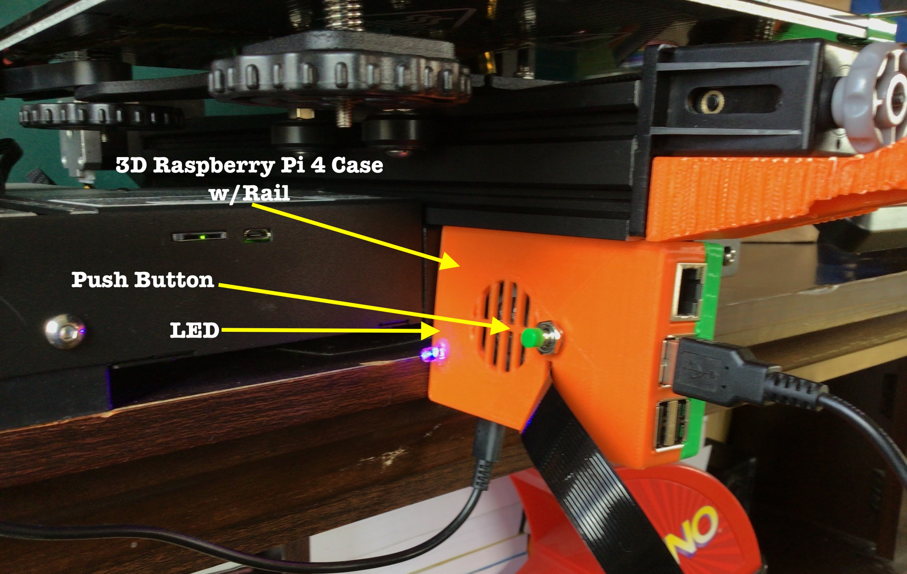
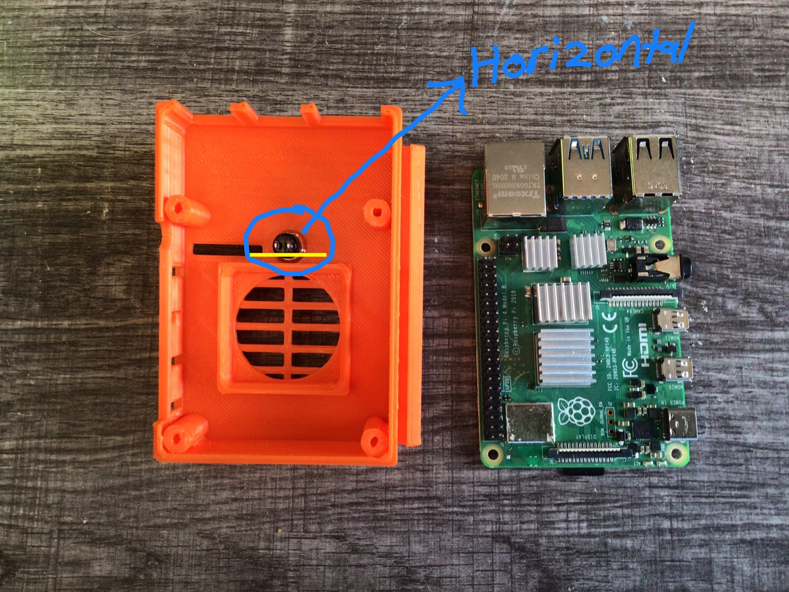
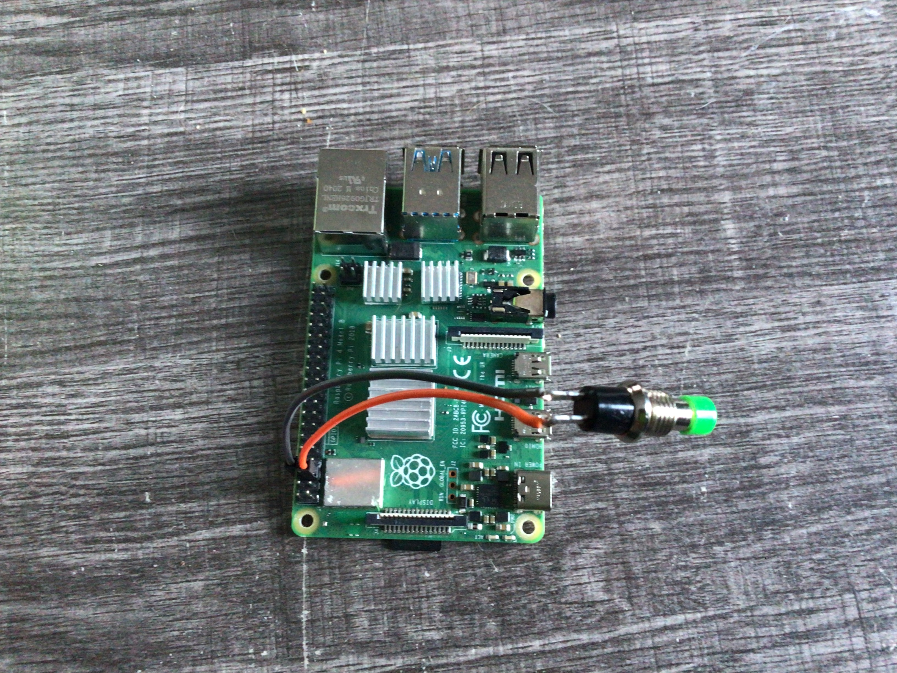
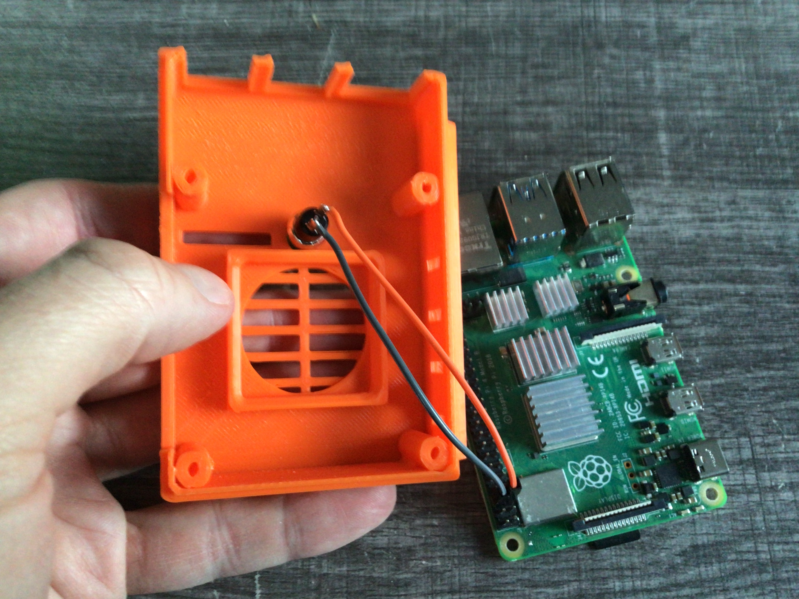
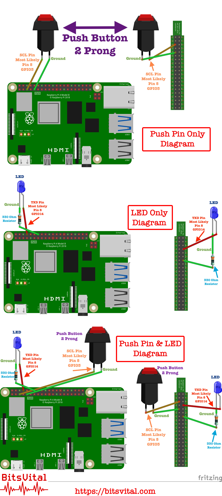

# Raspberry Pi Power On Off Script For Octoprint
<a rel="license" href="http://creativecommons.org/licenses/by-nc-sa/4.0/"></a>

[](https://digitalocean.com) 

<strong>Table of Contents</strong>
- [Raspberry Pi Power On Off Script For Octoprint](#raspberry-pi-power-on-off-script-for-octoprint)
  - [BitsVital](#bitsvital)
  - [Important!](#important)
  - [Github Repository](#github-repository)
  - [As Always With 'ALL‼️' BitsVital Apps, Programs, Scripts, Etc.](#as-always-with-all️-bitsvital-apps-programs-scripts-etc)
  - [Thingiverse Page](#thingiverse-page)
  - [About The Script](#about-the-script)
      - [Background](#background)
  - [A BIG THANK YOU!!!](#a-big-thank-you)
  - [3D Print Files](#3d-print-files)
  - [Instructions](#instructions)
    - [Bill of Sale Material](#bill-of-sale-material)
    - [3D Print Instructions For The Raspberry Pi 4 Case w/Rail](#3d-print-instructions-for-the-raspberry-pi-4-case-wrail)
      - [3D Printing Settings](#3d-printing-settings)
    - [3D Case Assembly Instructions](#3d-case-assembly-instructions)
        - [Wiring the push button](#wiring-the-push-button)
        - [Wiring the LED notification light](#wiring-the-led-notification-light)
        - [Assemble the case](#assemble-the-case)
    - [Script Installation Instructions](#script-installation-instructions)
        - [Uninstall](#uninstall)
  - [Software Version History](#software-version-history)
  - [Road Map (Future Plans)](#road-map-future-plans)
  - [Change Log](#change-log)
  - [Code of Conduct](#code-of-conduct)
  - [License](#license)
  - [Contact BitsVital](#contact-bitsvital)
  - [Social Media](#social-media)
  - [Help Support BitsVital (Buy us a lemonade)](#help-support-bitsvital-buy-us-a-lemonade)
  - [Copyright](#copyright)
## BitsVital
BitsVital is an online learning resource for children and adults.
Visit BitsVital at [https://bitsvital.com](https://bitsvital.com)
## Important!
There is absolutely <strong>'NO'</strong> guarantee or warranty with this or any BitsVital open source apps, programs, scripts, etc.
<strong>Use at your own peril/risk!</strong>

This script is intended to work only with Raspberry Pi's that have Octoprint installed!

## Github Repository

Original repository for this software can be found at:
[https://github.com/bitsvital/octoprint_on_off_button_script](https://github.com/bitsvital/octoprint_on_off_button_script)
## As Always With 'ALL‼️' BitsVital Apps, Programs, Scripts, Etc.
1. We developers at BitsVital love input. If you have a feature request, found a bug, or just wanna leave a comment, we LOVE ❤️ that! We love hearing from you!
2. Please be respectful and courteous when communicating with fellow users and us at BitsVital. Any type of put-downs, bullying, disrespectfulness towards another user will not be tolerated. We are all here to learn. We all make mistakes. At BitsVital, we are here to lift each other up. Not put them down!
3. Please and Thank you are not used enough. If requesting a feature request and you use 'please' and 'thank you', your request will send you to the front of the line. Remember when communicating with fellow users that 'please' and 'thank you' are powerful words that should be used more frequently! 

## Thingiverse Page
The Thingiverse page for this project can be found at: [https://www.thingiverse.com/make:1013261](https://www.thingiverse.com/make:1013261)

## About The Script

<strong>Important!</strong>
1. This script is intended to work only with a Raspberry Pi that has Octoprint installed!
2. The 3D print files are for Raspberry Pi 4 models only! The script should work with most if not all current Raspberry Pi's from the time of this scripts creation, 2022-02-15. Please see instructions below on verifying the correct SCL pin for the push button.

Raspberry Pi Power On / Power Off Script For Octoprint is a basic script for your Raspberry Pi's that works alongside a push button that is hard wired to your Raspberry Pi. As of 2022-02-15, Raspberry Pi's do not come with an on/off power button. Without a power on/off button, you are left with having to power off the Pi in two ways. One (1), if you have a GUI desktop installed, you can Restart/Power Off the Raspberry Pi through the GUI (Octoprint). Two (2), at the command line, invoke the shutdown procedure `sudo shutdown -now` or `sudo shutdown -h now`. 

The ```Raspberry Pi Power On Off Script For Octoprint``` is a simple script that will halt your Raspberry Pi utilizing hard wired push button. The script is called Raspberry Pi Power On Off Script For Octoprint as many who are unfamiliar or new to Raspberry Pi's are unware that turning on the Pi with a push-button does not require any script as explained in the instruction section of this document.

#### Background

The reason I (David Swanson) created this script and the updated version of the Raspberry Pi 4 case w/rail is for simplicity reasons 😀. My 3D printer is not close to my computer. Thanks to Octoprint and Raspberry Pi, I can wirelessly control my 3D printer. This also means I can place the 3D printer practically anywhere in my house. I have placed my 3D printer in a small corner of my house that is not close to my computer. When the 3D print is finished I walk over to the printer. Pull the print off the bed. And turn off the 3D printer. That leaves the Raspberry Pi Octoprint server still running. I have two options at this point. Pull the power cord to the PI; Which is HIGHLY not recommended, and you should try to avoid. Or two, go to the room with my computer, log into the OctoPrint server, and shut down the Pi from the GUI interface.

To save me a bit of time I have written this script and added a push button to my Raspberry Pi case. Now, when the print is finished I can turn off the 3D printer and at the same time turn off the Raspberry Pi with a push of a button. I tap the push button and the Raspberry Pi is halted. Next morning when I prepare the printer for a new print. I turn on the 3D printer. Tap the push button on the Raspberry Pi case, and the Raspberry Pi comes back to life and is ready for me to log into Octoprint.

I also added a simple LED light to the Raspberry Pi case too. When the Raspberry Pi is on the LED is lit. When I press the push button to halt the Raspberry Pi the LED turns off. It's hard to tell if the Raspberry Pi actually halted as the Raspberry Pi makes no noise and the fan is barely audible. With the LED notification light, I know for sure the Pi has halted.

## A BIG THANK YOU!!!

First, a huge thank you to the original creator of the Raspberry Pi 4 case.
John Sinclair's [https://www.thingiverse.com/thing:3723481](https://www.thingiverse.com/thing:3723481)
and
ixian [https://www.thingiverse.com/thing:4329248](https://www.thingiverse.com/thing:4329248)

## 3D Print Files

The 3D print STL files for the Raspberry Pi 4 Case w/rail in 3 different configurations can be found in the fold ```stl_files```
There are three different versions
1. Raspberry Pi 4 Case w/Rail (No holes for Push Button or LED notification light)
2. Raspberry Pi 4 Case w/Rail with hole for a two prong Push Button (NO LED Light Hole)
3. Raspberry Pi 4 Case w/Rail with holes for both a two prong Push Button and LED notification light as in the feature picture of this file!

## Instructions

### Bill of Sale Material

- Raspberry Pi 4 (The 3D Print file is for a Raspberry Pi 4. The script will work with most if not all Raspberry Pi's. You can find cases for other pies on the popular 3D printing website [Thingiverse.com](https://thingiverse.com)
- Octoprint installed on your Raspberry Pi
- 3D printer to print the Raspberry Pi 4 Case w/Rail.
- A two-prong push button for your Raspberry Pi
- LED diode light (Any color will work. In the feature image I choose a blue admitting LED)
- 330 Ohm resister

### 3D Print Instructions For The Raspberry Pi 4 Case w/Rail

1. The STL file is for a Raspberry Pi 4 only! The script will work with most, if not all Raspberry Pi's. Make sure to follow the instructions below to verify the correct SCL pin for your Pi.
2. The 3D printed case for the Raspberry Pi 4 Case w/Rail has been tested only on the Voxelab Aquila X2 3D Printer. If your 3D printer has rails with adequate space for the case the case most likely will work with your 3D printer. However, there is no guarantee.

After printing, I tapped the four screw holes with a M2.5 tap. 

#### 3D Printing Settings

Settings that are recommended for printing the Raspberry Pi 4 Case w/Rail.

<strong>Resolution:</strong> .1
<strong>Note:</strong> I have tested at .3 which was adequate. For something that will be seen and out on display, .1 resolution is highly recommended.

<strong>Infill:</strong> 100%
<strong>Note:</strong> The small prongs at the front of the case that separate the USB, and Cat 5 connections can break easily. I tried 20%, 40%, and 60%. Each time while installing the PI, one or two of the prongs broke. At 100%, the prongs are the strongest. I have printed three cases at 100% infill with no prongs breaking.

<strong>Supports:</strong> Not required
<strong>Note:</strong> Each printer and slicing program is different. With this print I found that no supports were required.

<strong>Rafts:</strong> Optional

<strong>Material: </strong>Recommended PLA or PLA+ (In the featured image of this document, I used Enyone PLA filament that I purchased on Amazon.com. Color: Green and Orange)

### 3D Case Assembly Instructions
<strong>Use the wiring diagram below</strong>

##### Wiring the push button

One of the prongs will be connect to the SCL pin of the Raspberry Pi. It's important to use the SCL pin as the SCL pin will allow us to wake the Raspberry Pi up from the halt mode. 
1. After printing Raspberry Pi 4 Case w/Rail insert the 2 prong push button into the middle hole of the case. Secure it with the included washer and nut. <strong>Important!</strong> Make sure the prongs on the push button are positioned horizontally, as shown in the picture below.
<strong>Note: </strong>It makes no difference which prongs you use on the push button for ground and the SCL pin on the Raspberry Pi. Solder one of the prongs on the push button to the GPIO SLC pin of the Raspberry Pi as pictured in the diagram on a Raspberry Pi 4. Most Raspberry Pi's SCL pin is Board Pin 5/GPIO3. To verify which pin is the SCL pin on your model of Raspberry Pi, please see [https://pinout.xyz](https://pinout.xyz). Solder the other pin to a ground pin on the Raspberry Pi 4. I used Pin 9 on my Raspberry Pi 4.






##### Wiring the LED notification light

2. Wire a 330 Ωohm resistor to the ground (cathode/negative) side of the LED. From the resitor solder to a ground pin on the Raspberry Pi. You can use any ground pin on the Raspberry Pi. On my Raspberry Pi 4 I choose Pin 9. 
3. On the positive (anode) side of the LED wire to the TXD pin. On the Raspberry Pi 4 it's pin 8. Again, verify with your Raspberry Pi.
##### Assemble the case

4. Once you have both the push button and LED notification light wired and soldered assemble case.
5. I used 4, M3x12mm screws to secure the top and bottom portion of the case


### Script Installation Instructions
Once you have your Raspberry Pi case printed and the push button and LED notification light wired and installed, it's time to install the software.

<strong>Important!</strong> In the file pi_pwr_button_on_off.py I have set the SCL pin for the push button to pin 5. This is set for a Raspberry Pi 4. It's always good to verify that your Raspberry Pi SCL pin is set to pin 5. If you changed pins or your Raspberry Pi uses a different pin for SCL make sure to change it in the pi_pwr_button_on_off.py file.

1. SSH into your Raspberry Pi Octoprint server
2. At the command prompt, make sure you are in the home directory
```cd /home/pi```
3. Clone our GitHub repository
```git clone https://github.com/bitsvital/octoprint_on_off_button_script.git```
4. Change into the new directory
```cd pi_pwr_button_on_off```
5. Give the install & uninstall script executive privilege
```sudo chmod +x install uninstall```
6. Install the script
```sudo ./install```
 
 It's time to test it. Press the push button once. There is no specific amount of time you must keep the button pushed in. One quick push will be just find. Wait up to thirty seconds to a minute, and the LED light should turn off, notifying you that the Raspberry Pi is now in halt mode.

 Press the push button again and give wait twenty or so seconds. You Raspberry Pi will boot back up and your LED notification light will come back on.

 ##### Uninstall

 If at anytime you would like to remove the Raspberry Pi Power Button On Off Script For Octoprint we have included a simple uninstall script that will remove the program.
 1. SSH into your Raspberry Pi
 2. Verify you are in the home directory
 ```cd /home/pi```
 3. Change into the script directory
 ```cd pi_pwr_button_on_off```
 4. Run the unisntall script
 ```sudo ./uninstall```
 5. Change back to the home directory
 ```cd /home/pi```
 6. Remove the script directory
 ```rm -Rf pi_pwr_button_on_off```

## Software Version History

0.1.0A -> Alpha Release 2022-02-03
0.2.0B -> Beta Release 2022-02-13
0.2.1B -> Beta Release 2022-02-15
1.0.0 <strong>(CURRENT VERSION)</strong>
## Road Map (Future Plans)

1. Add method for controlling (changing color) a RGB LED
2. Add additional features to the push button
   1. Hold for two seconds ... RGB light turns ...
   2. Hold for three seconds ex ... RGB light turns ...
   3. Tap three times turn on... RGB light turns ...
3. CLI configuration menu for the button. End-user can configure what the push button does and what color the RGB light turn for notification.

## Change Log

(Coming next software update)

## Code of Conduct

Please see CODE_OF_CONDUCT.md

## License

Creative Commons Attribution-NonCommercial-ShareAlike 4.0 International
Full License:[http://creativecommons.org/licenses/by-nc-sa/4.0/](http://creativecommons.org/licenses/by-nc-sa/4.0/)

## Contact BitsVital

There are a few ways to contact us at BitsVital.
1. If you have a feature request or found a bug please feel free to use the GitHub issues section.
2. BitsVital Support Forums: [https://bitsvital.com/forums](https://bitsvital.com/forums)
3. You can always contact BitsVital and all of our departments and personnel at: [https://bitsvital.com/communicate](https://bitsvital.com/communicate) 

## Social Media

Please feel free to follow BitsVital at:
<strong>Twitter: </strong>[https://twitter.com/bitsvital](https://twitter.com/bitsvital)
<strong>Facebook: </strong>[https://facebook.com/bitsvital](https://facebook.com/bitsvital)
<strong>YouTube </strong>[https://youtube.com/bitsvital](https://youtube.com/bitsvital)
<strong>GitHub </strong>[https://GitHub/bitsvital](https://GitHub/bitsvital)
<strong>Instagram </strong>[https://instagram/bitsvital](https://instagram/bitsvital)

## Help Support BitsVital (Buy us a lemonade)

Many of BitsVital scripts are licensed under an open-source free to use license. See the license section for full details. Everyone at BitsVital works hard to bring you software that is easy to use, beneficial, and most important, easy to understand documentation. In most of our software, it takes a minimum of twenty hours if not more and in some cases, hundreds of hours. This includes the development phase, testing phase, documenting phase, video instructions, video editing, audio, animation, etc. Sufficed to say, it takes a lot of work to bring you amazing software!

No matter what part of the world you live in and what the current economy is, we understand that you may not have the funds to help support us. That's okay; all of us at BitsVital understands! There are ways you can support us with out using any type of currency. Ex. Leave a message that you enjoy our software and how you are using it. Gives us a thumbs up on the blog post for the software, or write a blog post for BitsVital.

If you are able to help financially we would really appreciate it. Even if it's just a few coins! We accept crypto currency donations and credit cards. You can donate at [https://bitsvital.com/donate](https://bitsvital.com/donate)

## Copyright

Copyright 2022 BitsVital LLC All Rights Reserved